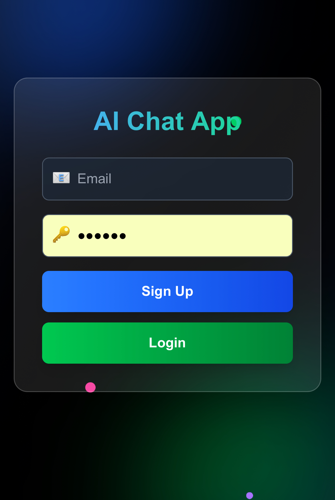
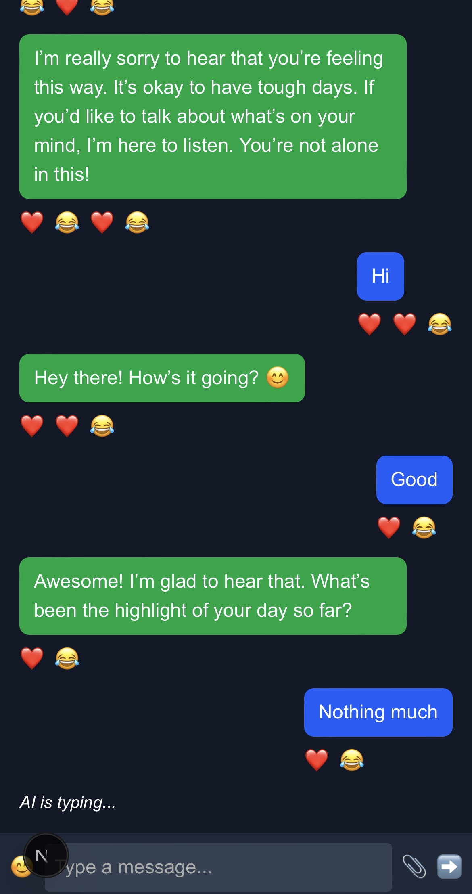
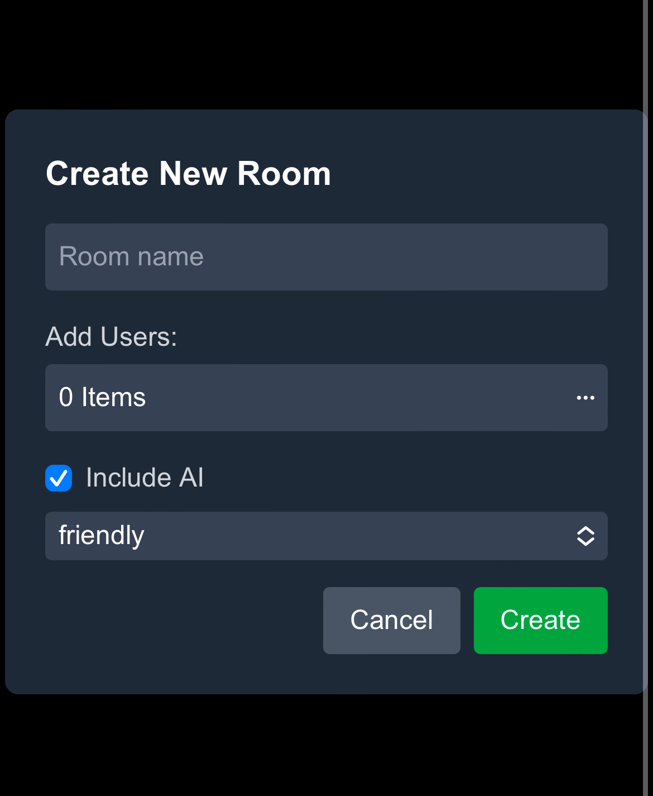
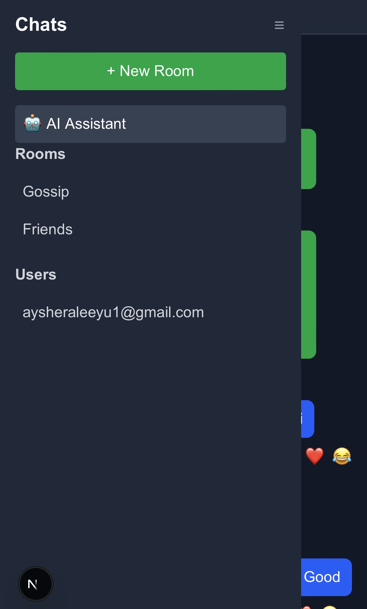

🚀 AI Chat App

A modern AI-powered chat application built with Next.js 14, Firebase, and OpenAI.
It supports real-time messaging, AI assistance, file sharing, reactions, message editing, and group chats — all wrapped in a sleek, responsive UI.

⸻

✨ Features
 • 🔑 Secure Authentication – Firebase email/password login
 • 💬 Real-time Chat – Messages sync instantly across all devices
 • 🤖 AI Assistant – Chat with an integrated AI bot (powered by OpenAI GPT-4o-mini)
 • 👥 Group Chats – Create rooms, add members, and collaborate
 • 📎 File Sharing – Upload and preview images directly in chat
 • 😀 Emoji Picker & Reactions – React to messages with emojis
 • ✏️ Edit & Delete – Long-press context menu like ChatGPT
 • 📱 Responsive Design – Optimized for mobile and desktop
 • 🔔 Typing Indicators – See when others (or AI) are typing
 • 🎨 Modern UI – TailwindCSS + custom animations for a smooth UX

⸻

🛠️ Tech Stack
 • Frontend: Next.js 14 (https://nextjs.org/) (App Router) + React (https://react.dev/)
 • Styling: TailwindCSS (https://tailwindcss.com/)
 • Auth & Database: Firebase Authentication, (https://firebase.google.com/products/auth) Firestore (https://firebase.google.com/products/firestore)
 • AI: OpenAI GPT-4o-mini (https://platform.openai.com/docs/)
 • Hosting: Vercel (https://vercel.com/)

⸻

📂 Project Structure

src/app/
 ├─ api/ai/route.js        # AI API endpoint (calls OpenAI)
 ├─ chat/page.jsx          # Main chat page
 ├─ components/            # UI components (ChatWindow, Sidebar, RoomModal, etc.)
 ├─ hooks/useAI.js         # Custom AI hook (handles AI messages & streaming)
 ├─ login/page.js          # Authentication page
 ├─ globals.css            # Global styles
 ├─ layout.js              # Root layout + metadata
 └─ page.js                # Landing page

src/lib/firebase.js        # Firebase configuration
public/                    # Icons, manifest, favicons

⚙️ Installation & Setup

1️⃣ Clone the repo
git clone https://github.com/Aisha-Aliyu/ai-chat-app.git
cd ai-chat-app

2️⃣ Install dependencies
npm install

3️⃣ Set up environment variables
Create a .env.local file in the root with:

NEXT_PUBLIC_FIREBASE_API_KEY=your_firebase_api_key
NEXT_PUBLIC_FIREBASE_AUTH_DOMAIN=your_project.firebaseapp.com
NEXT_PUBLIC_FIREBASE_PROJECT_ID=your_project_id
NEXT_PUBLIC_FIREBASE_STORAGE_BUCKET=your_project.appspot.com
NEXT_PUBLIC_FIREBASE_MESSAGING_SENDER_ID=your_sender_id
NEXT_PUBLIC_FIREBASE_APP_ID=your_app_id

OPENAI_API_KEY=your_openai_api_key

4️⃣ Run locally
npm run dev
App will be available at: http://localhost:3000

⸻

🚀 Deployment
 1. Push your code to GitHub/GitLab
 2. Connect repository to Vercel (https://vercel.com/)
 3. Add environment variables in Vercel dashboard
 4. Deploy 🎉

⸻

📸 Screenshots

📌 Roadmap
 • Push notifications
 • Voice messages
 • AI personalities selector
 • End-to-end encryption

⸻

🤝 Contributing

Contributions are welcome!
Fork the repo, create a feature branch, and submit a PR 🚀

⸻

👩‍💻 Author

Aisha Aliyu
💼 Software Engineer, Web developer & Game Developer
📍 Nigeria
 • Portfolio: https://www.aishaaliyu.com
 • TikTok: https://www.tiktok.com/@techgoddesss
 • LinkedIn: https://www.linkedin.com/in/aisha-aliyu-628b41376?utm_source=share&utm_campaign=share_via&utm_content=profile&utm_medium=ios_app

⸻

📜 License

This project is licensed under the MIT License – feel free to use, modify, and distribute.